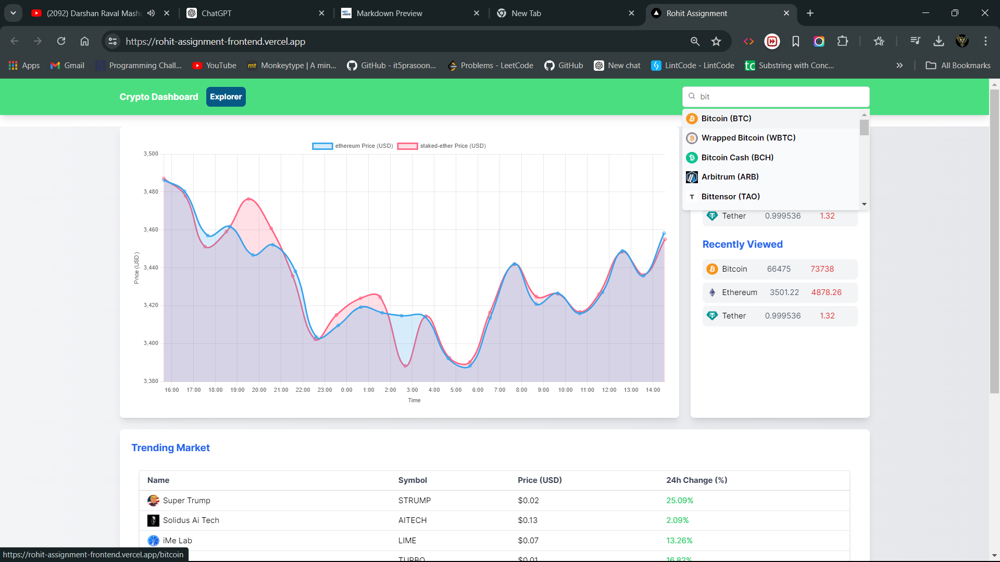
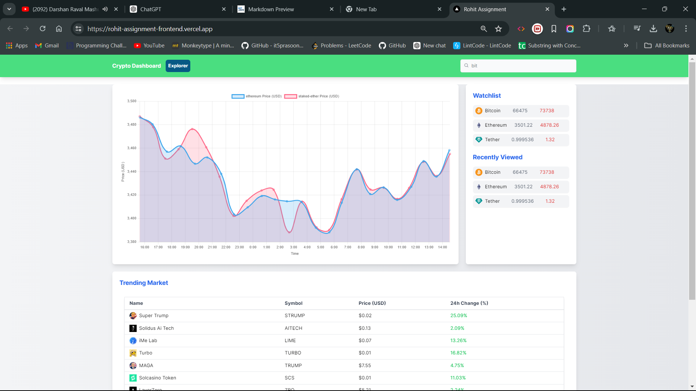
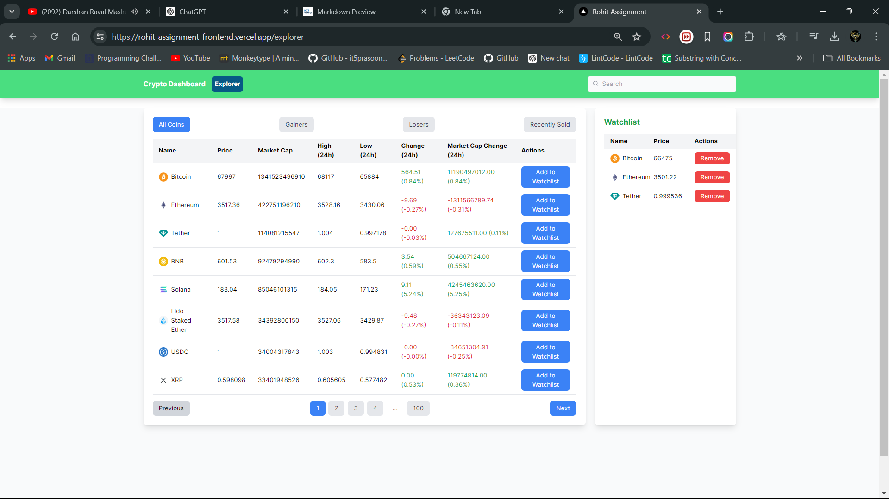
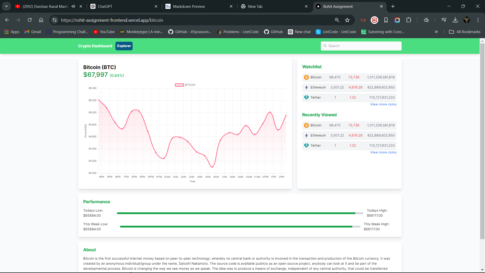

# Project Submission: Cryptocurrency Tracker Website

## Project Overview
This project is a web application for tracking cryptocurrencies, built using Next.js. It aims to provide real-time updates on cryptocurrency prices, detailed information on individual cryptocurrencies, and display global market trends.

## Objectives
1. Develop a user-friendly web application to track various cryptocurrencies.
2. Provide real-time updates on cryptocurrency prices.
3. Offer detailed information on individual cryptocurrencies, including historical data and market trends.

## Technologies Used
- **Frontend Framework:** Next.js
- **Styling:** Tailwind CSS, Styled-Components
- **State Management:** Redux/Redux Toolkit 
- **Deployment:** Vercel 
 


## Installation

Follow these steps to set up the Cryptonite application on your local machine:

1. **Clone the Repository:**

    ```bash
    git clone https://github.com/Rohitrky2021/Rohit_Assignment.git
    ```

2. **Navigate to the Project Directory:**

    ```bash
    cd Rohit_Assignment
    ```

3. **Install Dependencies:**

    Install the necessary dependencies for the project:

    ```bash
    npm install
    ```

4. **Run the Development Server:**

    Start the Next.js development server:

    ```bash
    npm run dev
    ```

    After running this command, the application will be available locally at [http://localhost:3000](http://localhost:3000).

# Features & Overview of the Website 

### 1. Homepage
- **Global Market Cap Chart:** Display a line or candle graph showing the global market cap data for cryptocurrencies.
- **Public Companies Holdings:** Display information about public companies holding Bitcoin and Ethereum.

#### Homepage Images



### 2. Explore Page
- **Paginated Coin List/Grid:** Display a paginated list or grid of cryptocurrencies, with each page containing 20 items and navigation to load more.
- **Navigation:** Clicking on a card routes the user to the product page of the selected cryptocurrency.

#### Explore Page Image


### 3. Product Page
- **Basic Information:** Display basic information about the selected cryptocurrency.
- **Price Graph:** Show a candle or line graph of the cryptocurrency’s price over time.

#### Product Page Image



### 4. Common Header
- **Application Name:** Display the name of the application.
- **Search Bar:** Include a search bar that shows suggested cryptocurrencies as the user types.
 
## API Integration
- **Primary API:** CoinGecko API for fetching real-time data and historical data.
- **Additional APIs:** Use additional APIs to fetch data on public companies holding Bitcoin and Ethereum (if required).

## Development Considerations
- **API Key:** Ensure to generate an API key and check the limits on requests per minute and per day.
- **State Management:** Use any state management library (Redux/Redux Toolkit, Zustand, Jotai).
- **Loading, Error, and Empty States:** Handle loading, error, and empty states appropriately.
- **Folder Structure:** Follow a standard, well-defined folder structure.
- **Responsive Design:** Ensure the UI is responsive and supports multiple screen sizes.
- **Deployment:** Deploy the working code on any website hosting platform (GitHub, Vercel, Netlify, Firebase).
- **Third-Party Libraries:** Avoid using utility libraries such as underscore.js, lodash, day.js.
- **Graph Libraries:** You can use a third-party library for line graphs.
- **Caching:** Cache API responses (with expiration) for all the pages.
- **UI Creativity:** Explore and use creativity to come up with a unique yet usable UI.

## Brownie Points
- **Dynamic Theme Switching:** Implement a dynamic theme-switching feature for toggling between Light and Dark modes.
- **Server-Side Rendering:** Utilize Next.js's server-side rendering capabilities.
- **Search Bar Suggestions:** Integrate a feature in the search bar to display recently searched items as suggestions.
- **Mock Live Price Ticker:** Simulate a live price ticker using a Pub-Sub mechanism, providing real-time updates on the product page.
 
## Frequently Asked Questions (FAQ)

### API and Data Handling
**Q: What happens if the API request limit is reached?**
- If the API request limit is reached, the website may temporarily stop fetching new data until the limit resets. You may see a message indicating that the API limit has been reached and suggesting you try again later.

 
**Q: What are the common API errors and rate limits?**
- Common API errors include exceeding the rate limit, invalid API keys, and network issues. Each API provider has specific rate limits, which are typically documented on their website.

 
## Useful Links
- [CoinGecko API Documentation](https://docs.coingecko.com/reference/introduction)
- [Setting Up Your API Key](https://docs.coingecko.com/reference/setting-up-your-api-key)
- [Common Errors and Rate Limits](https://docs.coingecko.com/reference/common-errors-rate-limit)

ThnakYou !
